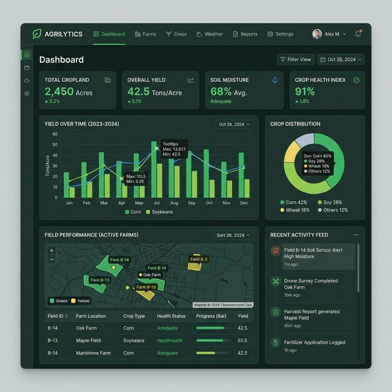
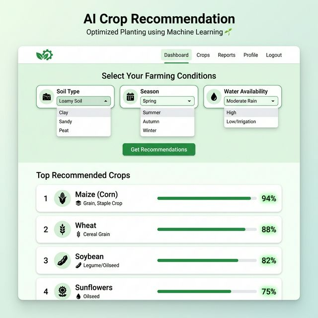

# AgriPortal

A modern, full-stack smart agriculture platform connecting farmers, agricultural data, and verified experts. Built with Django and integrated with a Machine Learning engine for AI-powered crop recommendations.

## Features

- **Machine Learning Crop Recommendation:** Uses a Scikit-Learn Decision Tree Classifier to recommend top crops based on local soil type, season, and water availability. Includes reasoning and confidence scoring.
- **Dynamic Crop Database:** Search and filter crop information dynamically without page reloads using the JavaScript Fetch API.
- **Community Q&A System:** An interactive forum where farmers ask questions and verified experts respond, featuring upvotes ("Helpful" button) and status tracking.
- **Interactive Dashboards:** Analytics dashboards for farmers and admins featuring Chart.js visual data representations and recent activity tracking.

## Tech Stack

- **Backend:** Python, Django, Django REST Framework
- **Frontend:** HTML5, CSS3, Bootstrap 5, Vanilla JavaScript (ES6)
- **Machine Learning:** Scikit-Learn (Decision Tree), Numpy
- **Database:** SQLite3 (Local Development) / MySQL (Ready)

## Screenshots

**Home & Analytics Dashboard**  


**Dynamic Crop Search Page**  


**AI Machine Learning Recommendation System**  


## Installation

1. Clone the repository:
```bash
git clone https://github.com/ChetanChavan45/smart-agriculture-portal.git
cd smart-agriculture-portal
```

2. Create and activate a virtual environment:
```bash
python -m venv venv
# On Windows:
.\venv\Scripts\activate
# On Mac/Linux:
source venv/bin/activate
```

3. Install the dependencies:
```bash
pip install -r requirements.txt
```

4. Apply database migrations:
```bash
python manage.py makemigrations
python manage.py migrate
```

## Usage

Start the local development server:
```bash
python manage.py runserver
```

Navigate to `http://127.0.0.1:8000/` in your web browser. You can register as either a Farmer to use the recommendation engine or as an Expert to answer community questions.
